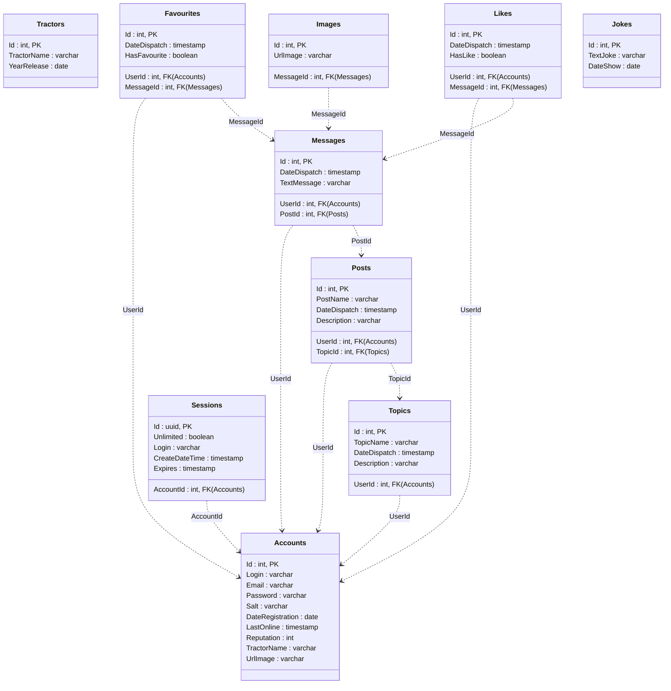

# Фермерские тракторы

***Фермерские тракторы*** - это сайт для фермерских трактористов.

### ***Как запустить семестровку?***
Создайте БД Postgres и выполните все скрипты из папки в указанном порядке ```DBScripts```. При необходимости поменять строку подключения на необходимую в файле ```Server/settings.json```.

### ***Функционал:***
- регистрация новых пользователей
- создание тем, постов и их просмотр c комментированием
- топ пользователей
- недавние действия
- новые сообщения, новые посты
- лайки
- личный профиль
- профили других пользователей
- аватарки
- поиск с фильтром по типу и дате
- фотографии в комментариях
- последний раз был в сети
- избранное

### ***Возможности зарегистрированного пользователя:***
- создание тем, постов и комментариев
- добавление в избранное
- возможность поставить лайк
- личный профиль

## Схема базы данных для семестровки 



### ***Навигация сайта***
1. ```/``` - главная страница со всеми темами
2. ```/topics/{TopicId}``` - определённый тема с постами к ней
3. ```/topics/{TopicId}/messages/{PostId}``` - определённый пост с комментариями к нему
4. ```/profile``` - профиль
5. ```/login``` - страница входа
6. ```/registration``` - страница регистрации
7. ```/newmessages``` - новые сообщения
8. ```/newposts``` - новые посты
9. ```/recentactivity``` - недавняя активность
10. ```/favourites``` - избранное
11. ```/topusers``` - топ пользователей
12. ```/users/{UserId}``` - профили пользователей
13. ```/find/{selectedType}/{selectedTime}``` - страница поиска с определенными фильтрами
14. ```/addtopic``` - страница с добавлением темы
15. ```/topic/{TopicId}/addpost``` - страница с добавлением поста
